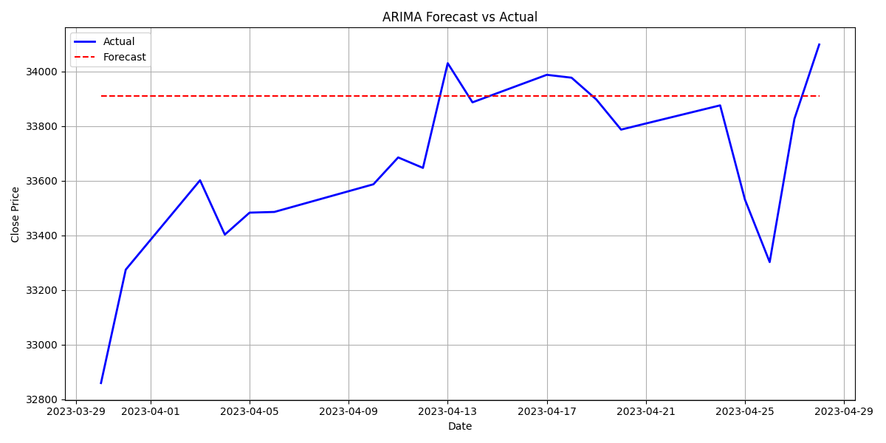
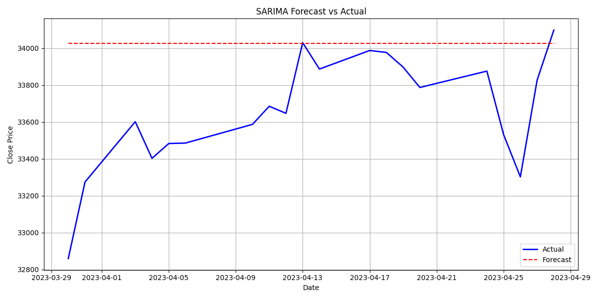
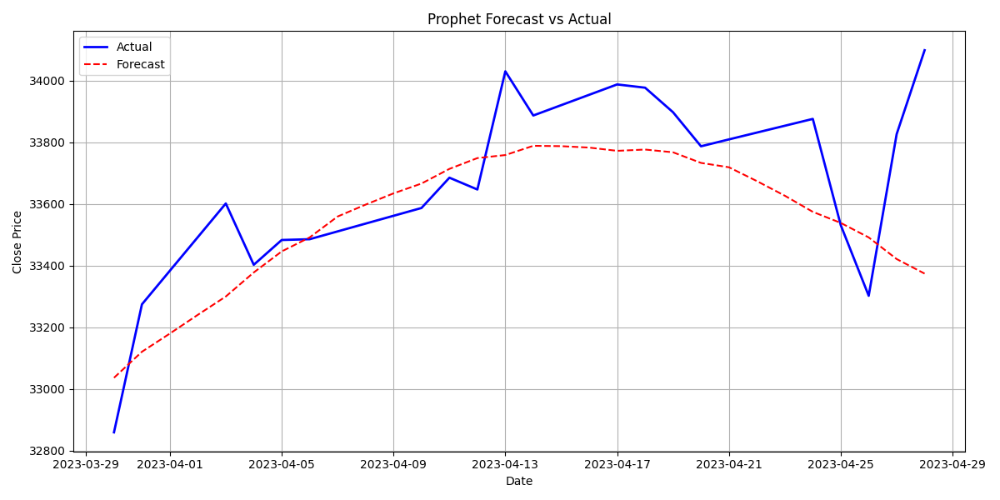
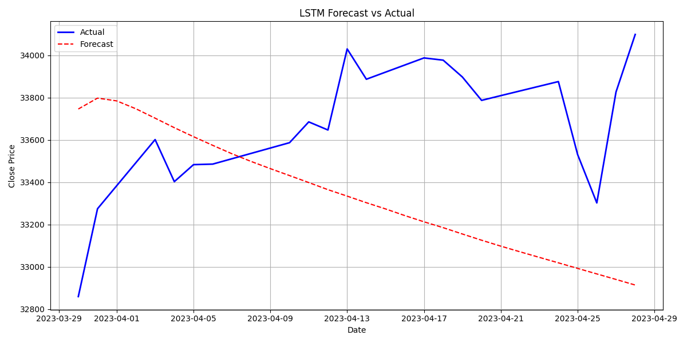
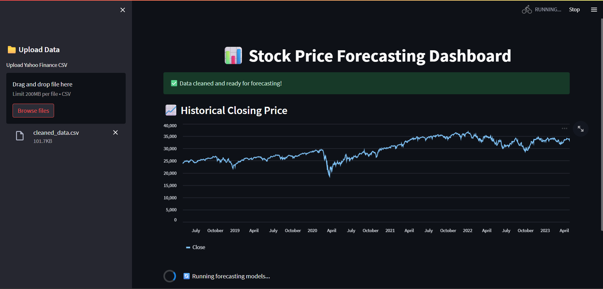

# Stock Market Time Series Forecasting Report

---

## Table of Contents
1. [Introduction](#introduction)
2. [Project Overview](#project-overview)
3. [Approach & Methodology](#approach--methodology)
4. [Models Used](#models-used)
5. [Evaluation Metrics](#evaluation-metrics)
6. [Results](#results)
7. [Visualizations](#visualizations)
8. [Conclusion](#conclusion)
9. [Future Work](#future-work)

---

## Introduction

Time series forecasting is crucial in financial markets, where investors seek predictive insights into stock price trends. This project focuses on building a modular and interpretable forecasting pipeline to analyze and predict stock prices using historical closing prices from Yahoo Finance.

---

## Project Overview

- **Objective**: Forecast future stock closing prices using historical data.
- **Scope**: Use statistical and machine learning techniques to analyze trends, forecast future prices, and evaluate model accuracy.
- **Data Source**: Yahoo Finance stock price history (CSV format).
- **Forecast Horizon**: 30 days.
- **Evaluation Metrics**: MAE, MSE, RMSE.

---

## ⚙️ Approach & Methodology

The project is divided into the following stages:

### 1. Data Preprocessing
- Parsed date fields and numeric values with commas.
- Set daily frequency and filled missing days using linear interpolation on the `Close` price.

### 2. Model Development
Four core models were used:
- **ARIMA**: For autoregressive and moving average modeling.
- **SARIMA**: Added seasonality to ARIMA.
- **Prophet**: Decomposes trends and seasonality automatically.
- **LSTM**: Deep learning model for sequential data with long-term memory.

### 3. Evaluation
- Evaluated all models on the **last 30 days** of the dataset.
- Computed standard regression metrics: **MAE**, **MSE**, and **RMSE**.
- Saved all forecast results and metrics for reproducibility.

### 4. Visualization & Reporting
- Forecasts were plotted against actual values.
- Best-performing model was identified based on **lowest RMSE**.
- An interactive Streamlit dashboard was created.

---

## Models Used

| Model    | Description |
|----------|-------------|
| **ARIMA**   | Classical statistical model for univariate time series |
| **SARIMA**  | Extension of ARIMA that accounts for seasonality |
| **Prophet** | Trend + seasonality decomposition model by Facebook |
| **LSTM**    | Recurrent neural network trained on normalized time sequences |

---

## Evaluation Metrics

Metrics are calculated on the final 30-day test set.

| Model    | MAE     | MSE         | RMSE    |
|----------|---------|-------------|---------|
| ARIMA    | `1460.157`  | `3790277`    | `1946.863`  |
| SARIMA   | `1551.981`  | `4129317.018`    | `2032.0721`  |
| Prophet  | `518.677`  | `520778.9391`    | `721.6501501`  |
| LSTM     | `285.2553`  | `112904.1601`    | `336.0121428`  |

---

## Visualizations

### ARIMA Forecast vs Actual

---

### SARIMA Forecast vs Actual

---

### Prophet Forecast vs Actual

---

### LSTM Forecast vs Actual

---

## Best Model

Based on RMSE:

> **LSTM** with **RMSE = 336.0121428**

Update this with the best model name and score from the metrics table.

---
## Streamlit Interface Preview

Below is a screenshot of the interactive dashboard built using [Streamlit](https://streamlit.io). Users can upload stock data, run all models, view forecasts and metrics, and identify the best model dynamically.

---

## Conclusion

- All four models were successfully trained and evaluated.
- Metrics indicate that **[Insert Best Model]** performed the best in this dataset.
- The project demonstrates how both statistical and deep learning models can be applied to real-world forecasting problems.

---

## Future Work

- Expand to multivariate forecasting (include Open, Volume, etc.).
- Integrate sentiment analysis from financial news.
- Add confidence intervals to predictions.
- Enable automated data fetching from Yahoo Finance API.
- Deploy on Streamlit Cloud for public access.

---

## Appendix

- `data/cleaned_data.csv` – Cleaned, interpolated dataset
- `outputs/forecasts/*.csv` – Forecast results
- `outputs/plots/*.png` – Forecast plots
- `app/streamlit_app.py` – Interactive visualization
